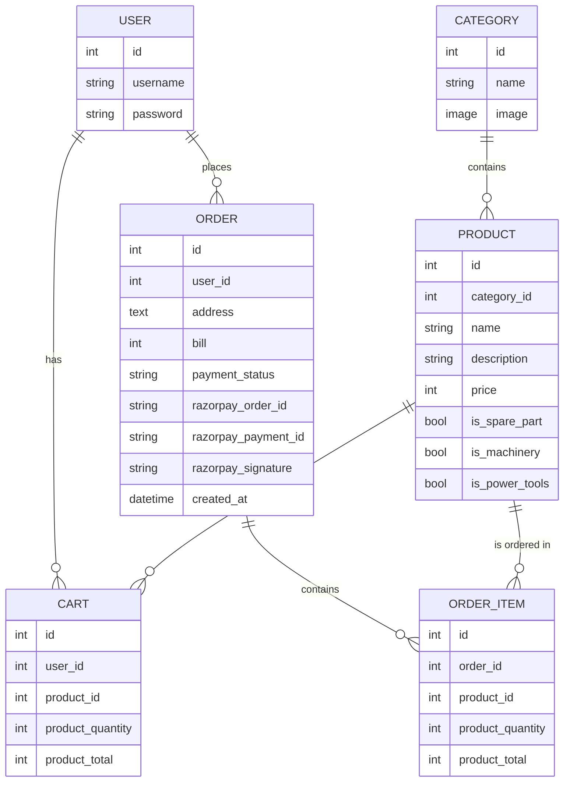
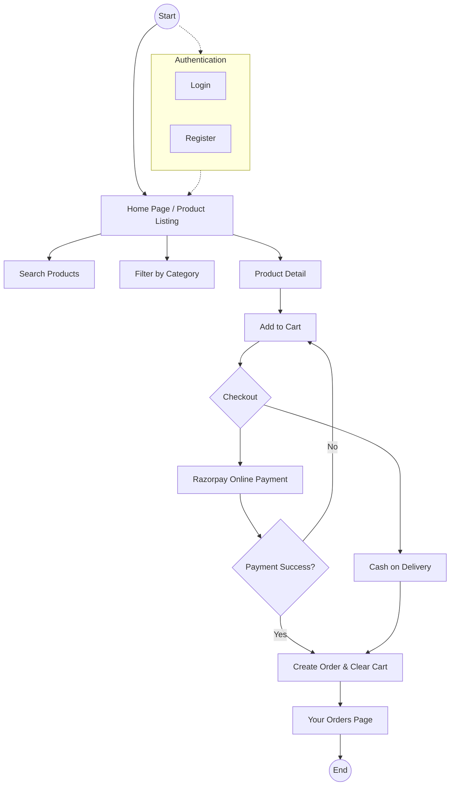

# Project Documentation
### BURHANI Hardware and Machinery

## 1. Introduction
**BURHANI Hardware and Machinery** is a web-based E-commerce platform developed using the Django framework. The application is designed to manage the sales of hardware products, machinery, power tools, and spare parts. It provides a seamless shopping experience for users, allowing them to browse categories, manage a virtual cart, and securely place orders using online payment or cash on delivery.

## 2. Project Status
The project is currently **LIVE** and accessible at:
[https://burhani-hardware-machinery.onrender.com](https://burhani-hardware-machinery.onrender.com)

## 3. Technologies Used
- **Frontend**: HTML5, CSS3, JavaScript (Vanilla)
- **Backend**: Python 3.x, Django 5.x
- **Database**: SQLite3 (Development) / PostgreSQL (Production)
- **Payment Gateway**: Razorpay Integration
- **Media Management**: Cloudinary Integration
- **Hosting**: Render Platform

## 4. Key Features
- **User Authentication**: Secure Registration, Login, and Logout functionality.
- **Product Management**: Categorized products (Machinery, Power Tools, Spare Parts).
- **Search & Filter**: Real-time product search and category-based filtering.
- **Shopping Cart**: Dynamic cart management (Add, Remove, Update quantity).
- **Secure Checkout**:
    - **Online Payment**: Integrated with Razorpay for secure transactions.
    - **Cash on Delivery (COD)**: Traditional payment option.
- **Order Tracking**: Users can view their order history and status.
- **Responsive Design**: Optimized for both desktop and mobile devices.

## 5. Database Design (ER Diagram)
The following diagram shows the relationships between Users, Products, Carts, and Orders.

## 6. Workflow Diagram
This flowchart illustrates the complete user journey from browsing to successful order placement.

## 7. Conclusion
The BURHANI Hardware and Machinery project successfully demonstrates the implementation of a full-stack e-commerce solution. It covers essential aspects of software development, including database management, backend logic, frontend integration, and third-party API usage (Razorpay). The project is deployed and fully functional in a production environment.
