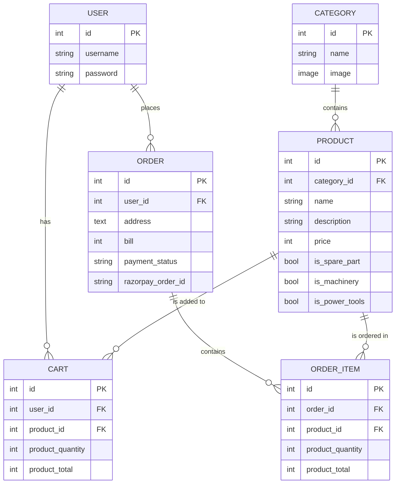
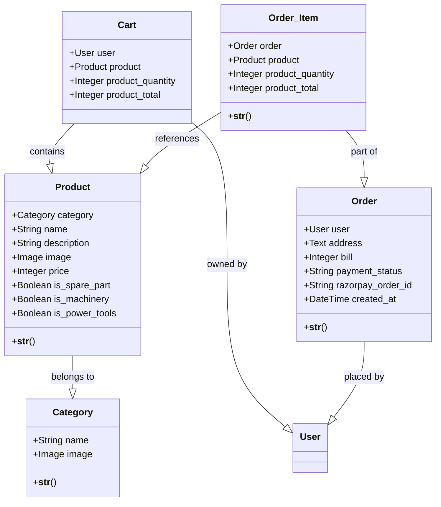

# Project Report: BURHANI Hardware and Machinery

---

## CHAPTER 1: INTRODUCTION

### 1.1 Abstract
**BURHANI Hardware and Machinery** is a comprehensive web-based E-commerce solution tailored for the hardware industry. The platform enables users to browse, search, and purchase hardware tools, machinery, and spare parts online. Developed using the Django framework, it integrates secure payment processing via Razorpay and efficient media management through Cloudinary. The system aims to bridge the gap between traditional hardware retail and modern digital convenience.

### 1.2 Existing System and Need for System
**Existing System:**
Traditionally, hardware stores rely on manual record-keeping or basic desktop applications. Customers must physically visit the store to check availability, compare prices, or place orders.
**Drawbacks:**
- Limited geographical reach.
- Time-consuming manual inventory tracking.
- Lack of 24/7 accessibility for customers.
- Potential for human error in billing and order management.

**Need for System:**
The proposed system addresses these issues by providing a centralized online platform. It automates order processing, provides real-time catalog access, and offers secure online payment options, significantly improving operational efficiency and customer satisfaction.

### 1.3 Scope of System
The scope includes:
- **User Management:** Secure registration and authentication.
- **Catalog Management:** Categorized display of products (Machinery, Power Tools, Spare Parts).
- **Search & Filtering:** Fast retrieval of products based on name or category.
- **Order Lifecycle:** Cart management, secure checkout, and order tracking.
- **Payment Integration:** Support for both Online (Razorpay) and Cash on Delivery (COD).

### 1.4 Operating Environment Hardware and Software
**Hardware Requirements:**
- **Processor:** Dual Core 2.0 GHz or higher.
- **RAM:** 4 GB minimum (8 GB recommended).
- **Storage:** 500 MB for application files + database growth.
- **Internet:** Stable connection for hosting and payment gateway communication.

**Software Requirements:**
- **Operating System:** Windows 10/11, Linux (Ubuntu/Debian), or macOS.
- **Programming Language:** Python 3.10+.
- **Web Framework:** Django 5.x.
- **Database:** SQLite3 (Development), PostgreSQL (Production).
- **Browser:** Modern browsers (Chrome, Firefox, Safari, Edge).

### 1.5 Brief Description of Technology Used
- **Python & Django:** Backend logic, ORM for database management, and URL routing.
- **HTML5 & CSS3:** Structural layout and responsive design.
- **JavaScript (Vanilla):** Dynamic UI interactions.
- **Razorpay API:** Secure online payment processing.
- **Cloudinary:** Cloud-based image hosting and optimization.
- **Render:** Cloud platform for deployment.

---

## CHAPTER 2: PROPOSED SYSTEM

### 2.1 Feasibility Study
- **Technical Feasibility:** Django provides a robust and secure foundation. The team has the necessary skills to maintain the Python-based backend and frontend components.
- **Economic Feasibility:** The system uses open-source technologies (Django, SQLite/PostgreSQL), reducing software licensing costs. The potential for increased sales outweighs the hosting and maintenance costs.
- **Operational Feasibility:** The user-friendly interface ensures that even non-technical users can navigate the platform easily. Admins can manage the entire store via the Django Admin interface.

### 2.2 Objectives of the Proposed System
- To provide a user-friendly platform for hardware procurement.
- To automate the billing and order tracking process.
- To ensure secure financial transactions for online customers.
- To maintain an organized digital record of all products and sales.

---

## CHAPTER 3: ANALYSIS AND DESIGN

### 3.1 Entity Relationship Diagram (ERD)


### 3.2 Class Diagram


### 3.3 Use Case Diagrams
```mermaid
useCaseDiagram
    actor Customer
    actor Admin
    
    package "BURHANI E-Commerce" {
        usecase "Register/Login" as UC1
        usecase "Browse Products" as UC2
        usecase "Manage Cart" as UC3
        usecase "Checkout (Online/COD)" as UC4
        usecase "View Order History" as UC5
        usecase "Manage Products/Categories" as UC6
        usecase "Monitor Orders" as UC7
    }
    
    Customer --> UC1
    Customer --> UC2
    Customer --> UC3
    Customer --> UC4
    Customer --> UC5
    
    Admin --> UC1
    Admin --> UC6
    Admin --> UC7
```

### 3.4 Table Design
| Table Name | Description |
| :--- | :--- |
| `auth_user` | Django built-in table for user credentials. |
| `BurhaniApp_category` | Stores product categories (e.g., Machinery). |
| `BurhaniApp_product` | Detailed information about each hardware item. |
| `BurhaniApp_cart` | Temporary storage for user-selected items. |
| `BurhaniApp_order` | Master table for successful purchases. |
| `BurhaniApp_order_item` | Child table for products within an order. |

### 3.5 Data Dictionary
**Table: Product**
| Field Name | Data Type | Constraints | Description |
| :--- | :--- | :--- | :--- |
| id | Integer | Primary Key | Unique ID for the product. |
| category_id | Integer | Foreign Key | Reference to Category table. |
| name | Varchar(100) | Not Null | Name of the product. |
| description | Text | Not Null | Product specifications. |
| price | Integer | Not Null | Cost in INR. |
| is_machinery | Boolean | Default False | Flag for machinery type. |

### 3.6 Sample Input and Output Screens
- **Home Page:** Displays featured categories and the 12 most recent products.
- **Product Detail:** Shows full description and "Add to Cart" option.
- **Cart Page:** Lists items with quantity adjustment and total calculation.
- **Checkout:** Form for address input and selection of payment method.
- **Orders Page:** A history of all past transactions with status updates.

---

## CHAPTER 4: CODING Sample code

**Model Implementation (models.py):**
```python
class Product(models.Model):
    category = models.ForeignKey(Category, on_delete=models.CASCADE)
    name = models.CharField(max_length=100)
    description = models.TextField()
    price = models.IntegerField()
    is_machinery = models.BooleanField(default=False)
```

**Payment Processing (views.py):**
```python
@csrf_exempt
def payment_callback(request):
    payment_id = request.POST.get("razorpay_payment_id")
    razorpay_order_id = request.POST.get("razorpay_order_id")
    signature = request.POST.get("razorpay_signature")
    # Verification logic and order creation...
```

---

## CHAPTER 5: LIMITATIONS OF SYSTEM
- Does not support multi-vendor inventory management.
- Lacks real-time stock level tracking (inventory depletion).
- No built-in AI for personalized product recommendations.

---

## CHAPTER 6: PROPOSED ENHANCEMENTS
- Integration of a Chatbot for customer support.
- Implementation of a real-time inventory management system.
- Development of a dedicated Mobile Application (Flutter/React Native).
- Advanced Analytics Dashboard for Admin to track sales trends.

---

## CHAPTER 7: CONCLUSION
The **BURHANI Hardware and Machinery** project successfully delivers a scalable and secure e-commerce platform. It demonstrates the power of the Django framework in handling complex business logic and third-party integrations like Razorpay. The system effectively solves the limitations of traditional hardware retailing by providing a modern digital storefront.

---

## CHAPTER 8: BIBLIOGRAPHY
1. Django Documentation (https://docs.djangoproject.com/)
2. Python Official Website (https://www.python.org/)
3. Razorpay API Reference (https://razorpay.com/docs/)
4. Mermaid.js Documentation (https://mermaid-js.github.io/)
5. Web Development with Django by Jeff Forcier.
