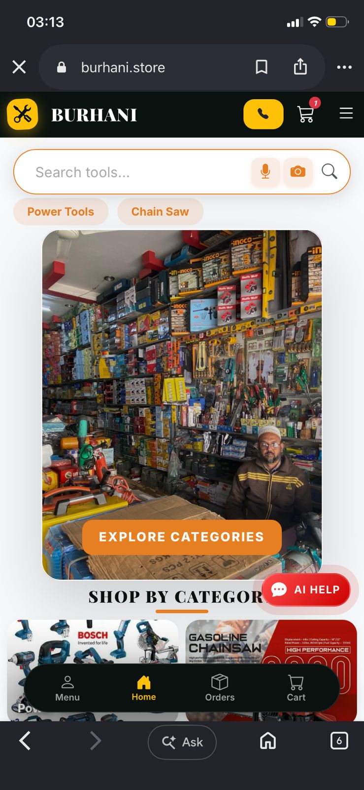
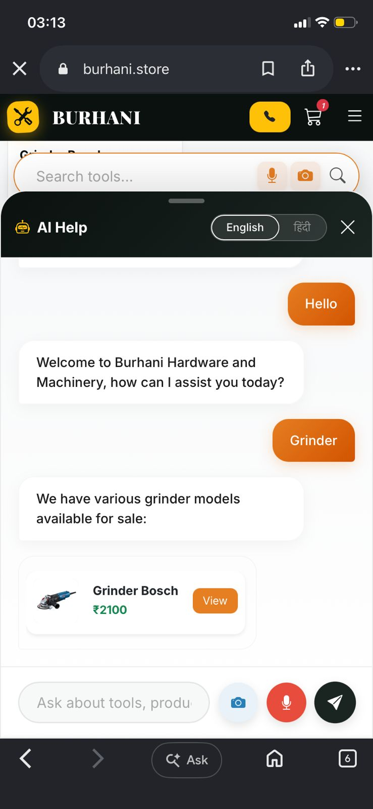
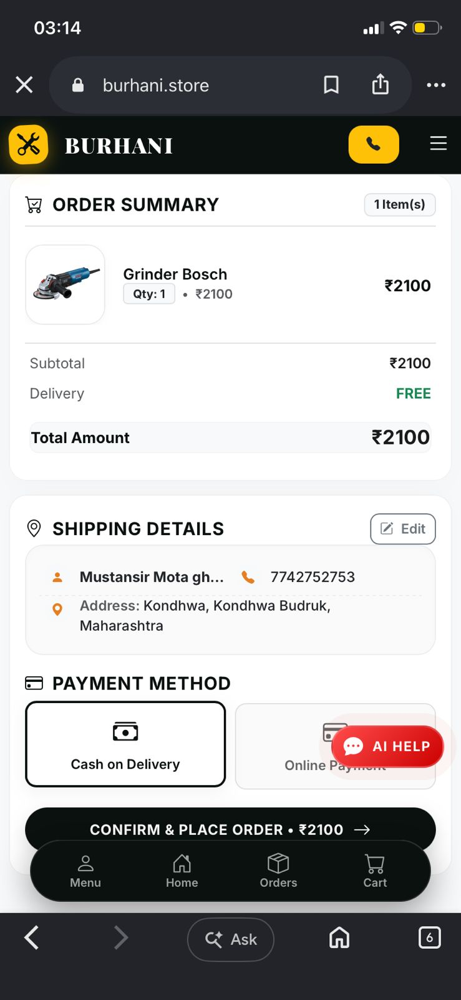

<div align="center">
  
  <h1>Burhani Hardware & Machinery Store</h1>
  <p><strong>A Production-Ready, Full-Stack E-Commerce Platform Built with Django</strong></p>
  
  <a href="https://burhani.store">View Live Site</a> • 
  <a href="#features">Features</a> • 
  <a href="#tech-stack">Tech Stack</a> • 
  <a href="#installation">Installation</a>
</div>

<br/>

> **Note:** This project is currently live at [burhani.store](https://burhani.store). It serves as a real-world e-commerce platform for a hardware and machinery business in Bhawani Mandi, Rajasthan.

---

## 📸 Project Screenshots


<div align="center">
  
</div>

<br/>

| Advanced AI Chatbot | Checkout & Payments |
| :---: | :---: |
|  |  |

---

## 🚀 Features

This platform goes beyond a standard e-commerce site by integrating modern AI and Cloud technologies:

* **🎙️ AI-Powered Search & Assistant:** Integrated with the Groq API to provide a custom AI chatbot and Voice Search capabilities for users.
* **🔐 Advanced Authentication:** Supports seamless Google OAuth (via `django-allauth`) and custom OTP-based mobile login via Fast2SMS.
* **💳 Secure Payments:** Fully integrated Razorpay payment gateway for processing seamless online transactions.
* **☁️ Cloud Infrastructure:** Utilizes Cloudinary for persistent media storage and WhiteNoise for efficient static file serving.
* **📱 Premium Responsive UI:** Custom frontend interface prioritizing mobile users with an iOS-style bottom sheet offcanvas navigation and a beautiful glassmorphism design system.
* **📈 SEO Optimized:** Built-in dynamic Meta Tags, Open Graph tags, and Schema.org local business JSON-LD markup for maximum search engine visibility.

---

## 🛠 Tech Stack

### Backend
* **Framework:** Django 6.0 (Python 3)
* **Database:** PostgreSQL (Neon DB Serverless)
* **Authentication:** Django Allauth, Fast2SMS API

### Frontend
* **Core:** HTML5, CSS3, JavaScript (Vanilla)
* **Styling:** Bootstrap 5.3 + Custom CSS Tokens
* **Icons:** Bootstrap Icons

### DevOps & APIs
* **Deployment:** Render
* **Media Storage:** Cloudinary (`django-cloudinary-storage`)
* **Static Files:** WhiteNoise
* **Payments:** Razorpay API
* **AI Engine:** Groq API

---

## ⚙️ Local Installation

Want to run this project locally? Follow these steps:

### 1. Clone the repository
```bash
git clone https://github.com/yourusername/burhani-hardware.git
cd burhani-hardware
```

### 2. Set up a virtual environment
```bash
python -m venv venv
# On Windows
venv\Scripts\activate
# On Mac/Linux
source venv/bin/activate
```

### 3. Install dependencies
```bash
pip install -r requirements.txt
```

### 4. Configure Environment Variables
Create a `.env` file in the root directory and add the following keys:
```env
SECRET_KEY=your-django-secret-key
DEBUG=True
ALLOWED_HOSTS=127.0.0.1 localhost

# Cloudinary
CLOUDINARY_CLOUD_NAME=your_cloud_name
CLOUDINARY_API_KEY=your_api_key
CLOUDINARY_API_SECRET=your_api_secret

# Third Party APIs
RAZORPAY_KEY_ID=your_razorpay_id
RAZORPAY_KEY_SECRET=your_razorpay_secret
FAST2SMS_KEY=your_fast2sms_key
GROQ_API_KEY=your_groq_api_key
```

### 5. Run Migrations & Start Server
```bash
python manage.py migrate
python manage.py runserver
```
Visit `http://127.0.0.1:8000` to view the application!

---

## 👨‍💻 Author

**Built by [MUSTANSIR]**
* [LinkedIn](https://www.linkedin.com/in/mustansir-mota-ghar-wala/) | [GitHub](https://github.com/mustansir-mota-ghar-wala) | [Portfolio](https://mustanir-mota-ghar-wala-portfolio.vercel.app/)
